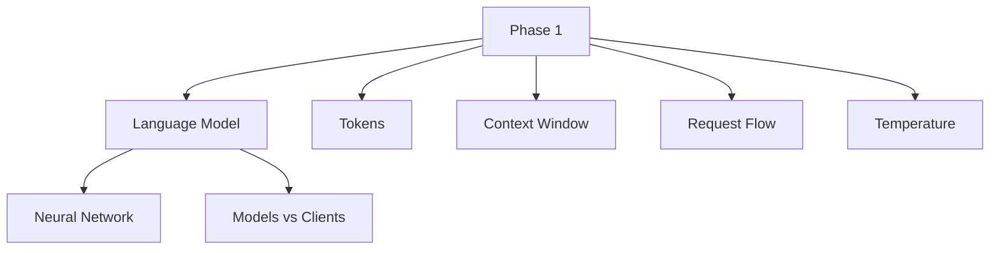
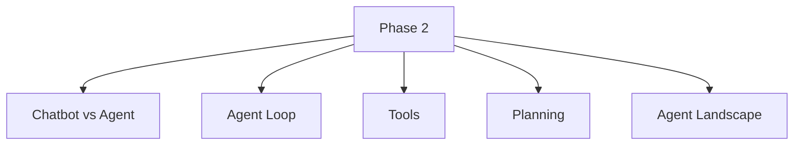
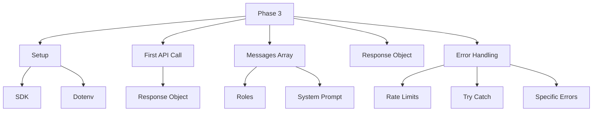
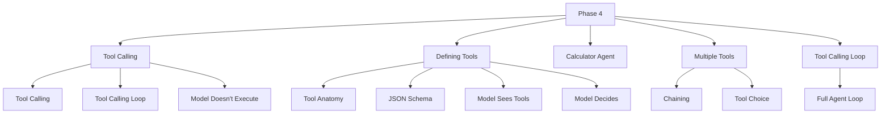
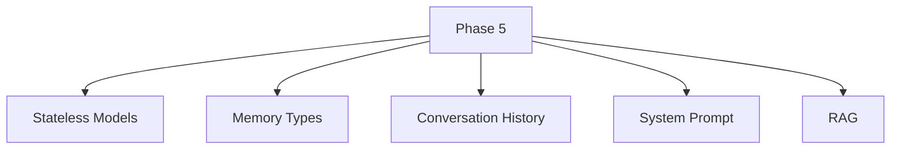
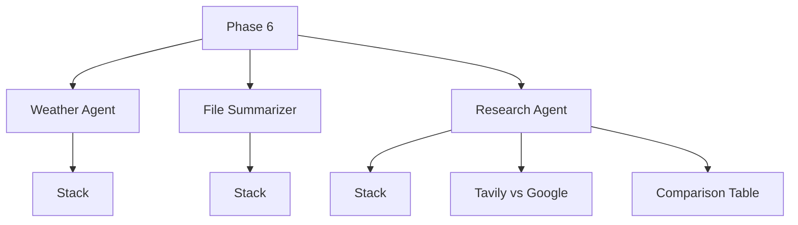
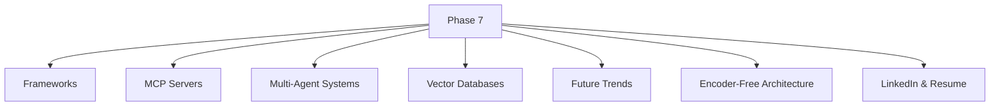

# Agentic AI for Vibe Coders — Course Structure

> Each phase is documented below. New phases are added as they are reviewed.

---

## Phase 1 — How AI Models Actually Work

---

## Phase 2 — What Makes an AI Agentic

---

## Phase 3 — Your First Real API Call

---

## Phase 4 — Tool Calling: The Heart of Agents

---

## Phase 5 — Memory and Context Management

---

## Phase 6 — Building Real Agents: 3 Projects

---

## Phase 7 — The Bigger Picture

