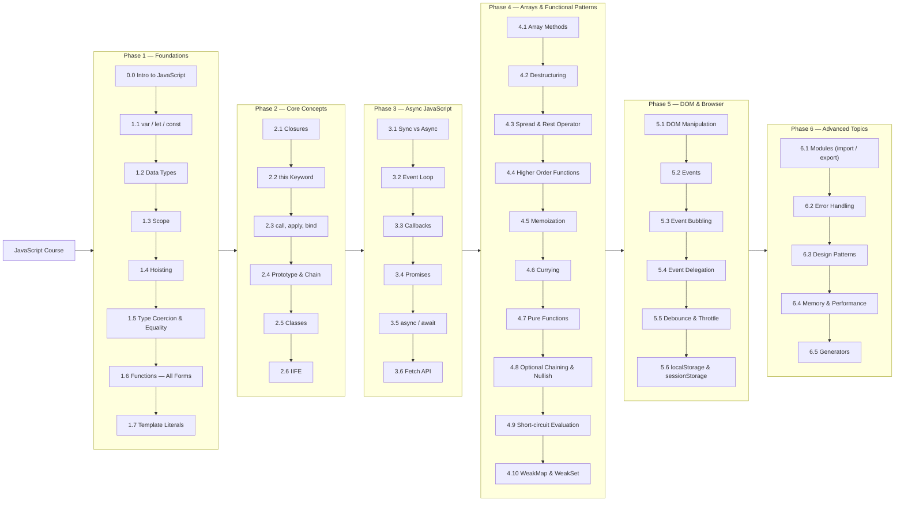

# JavaScript Course — Mermaid Flowchart

Copy the code below and paste it into [Mermaid Live Editor](https://mermaid.live) or any Mermaid-compatible viewer.

```mermaid
flowchart LR
    ROOT["JavaScript Course"]

    subgraph P1["Phase 1 — Foundations"]
        direction TB
        P1_0["0.0 Intro to JavaScript"]
        P1_1["1.1 var / let / const"]
        P1_2["1.2 Data Types"]
        P1_3["1.3 Scope"]
        P1_4["1.4 Hoisting"]
        P1_5["1.5 Type Coercion & Equality"]
        P1_6["1.6 Functions — All Forms"]
        P1_7["1.7 Template Literals"]
    end

    subgraph P2["Phase 2 — Core Concepts"]
        direction TB
        P2_1["2.1 Closures"]
        P2_2["2.2 this Keyword"]
        P2_3["2.3 call, apply, bind"]
        P2_4["2.4 Prototype & Chain"]
        P2_5["2.5 Classes"]
        P2_6["2.6 IIFE"]
    end

    subgraph P3["Phase 3 — Async JavaScript"]
        direction TB
        P3_1["3.1 Sync vs Async"]
        P3_2["3.2 Event Loop"]
        P3_3["3.3 Callbacks"]
        P3_4["3.4 Promises"]
        P3_5["3.5 async / await"]
        P3_6["3.6 Fetch API"]
    end

    subgraph P4["Phase 4 — Arrays & Functional Patterns"]
        direction TB
        P4_1["4.1 Array Methods"]
        P4_2["4.2 Destructuring"]
        P4_3["4.3 Spread & Rest Operator"]
        P4_4["4.4 Higher Order Functions"]
        P4_5["4.5 Memoization"]
        P4_6["4.6 Currying"]
        P4_7["4.7 Pure Functions"]
        P4_8["4.8 Optional Chaining & Nullish"]
        P4_9["4.9 Short-circuit Evaluation"]
        P4_10["4.10 WeakMap & WeakSet"]
    end

    subgraph P5["Phase 5 — DOM & Browser"]
        direction TB
        P5_1["5.1 DOM Manipulation"]
        P5_2["5.2 Events"]
        P5_3["5.3 Event Bubbling"]
        P5_4["5.4 Event Delegation"]
        P5_5["5.5 Debounce & Throttle"]
        P5_6["5.6 localStorage & sessionStorage"]
    end

    subgraph P6["Phase 6 — Advanced Topics"]
        direction TB
        P6_1["6.1 Modules (import / export)"]
        P6_2["6.2 Error Handling"]
        P6_3["6.3 Design Patterns"]
        P6_4["6.4 Memory & Performance"]
        P6_5["6.5 Generators"]
    end

    %% Phase sequencing
    ROOT --> P1
    P1 --> P2
    P2 --> P3
    P3 --> P4
    P4 --> P5
    P5 --> P6

    %% Sequential flow within each phase
    P1_0 --> P1_1 --> P1_2 --> P1_3 --> P1_4 --> P1_5 --> P1_6 --> P1_7

    P2_1 --> P2_2 --> P2_3 --> P2_4 --> P2_5 --> P2_6

    P3_1 --> P3_2 --> P3_3 --> P3_4 --> P3_5 --> P3_6

    P4_1 --> P4_2 --> P4_3 --> P4_4 --> P4_5 --> P4_6 --> P4_7 --> P4_8 --> P4_9 --> P4_10

    P5_1 --> P5_2 --> P5_3 --> P5_4 --> P5_5 --> P5_6

    P6_1 --> P6_2 --> P6_3 --> P6_4 --> P6_5

```
